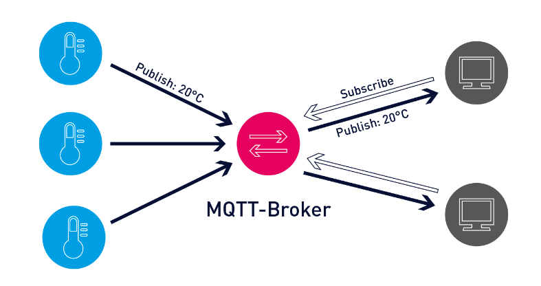

# MQTT server & clients for IOT Apllications

## Contents
- [Server](#Server)
- [Clients](#Clients)

## Server
MQTT Broker:
- [Mosquitto](https://mosquitto.org/) running in Raspberry Pi Pico 3b+.

## Clients
MQTT Clients:
- uC (RP2040 - [Raspberry Pi Pico](https://www.raspberrypi.com/products/raspberry-pi-pico/)) 
- Web Browser
- Apps [App Inventor](https://appinventor.mit.edu/)
